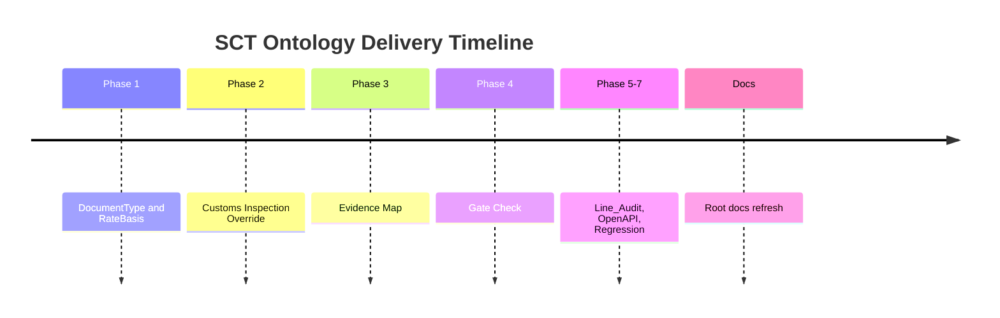

# Changelog

## 2026-06-08

### Added

- Added root documentation set: `README.md`, `SYSTEM_ARCHITECTURE.md`, `LAYOUT.md`, and `CHANGELOG.md`.
- Added this root documentation update after Phase 1 through Phase 7 SCT Ontology implementation work.
- Documented current Action surface, Worker architecture, repository layout, and verification commands.

### Current Implementation Snapshot

| Phase | Commit | Summary |
|---|---|---|
| Phase 1 | `23aed2c` | Ontology seed for DocumentType and RateBasis. |
| Phase 2 | `12223da` | Customs Inspection override priority. |
| Phase 3 | `6a12bdf` | Evidence map validation. |
| Phase 4 | `bfdc885` | Gate-check blockers for subtotal, rate basis, gaps, and tie-out. |
| Phase 5-7 | `d51e062` | Line_Audit, OpenAPI/GPTS alignment, and regression batch. |

### Runtime Evidence

- Production Worker URL: `https://hvdc-ontology-chatgpt-app.mscho715.workers.dev`
- Runtime health observed during documentation update: `HVDC-SCT-ONTOLOGY-GPT-ACTIONS-REST-v2.4.0`
- Supported route count: 9

### Notes

- This changelog does not replace `docs/superpowers/reports/2026-06-08-sct-ontology-deployment.md`.
- Keep raw contract rates, private identifiers, and approval text out of public documentation.

