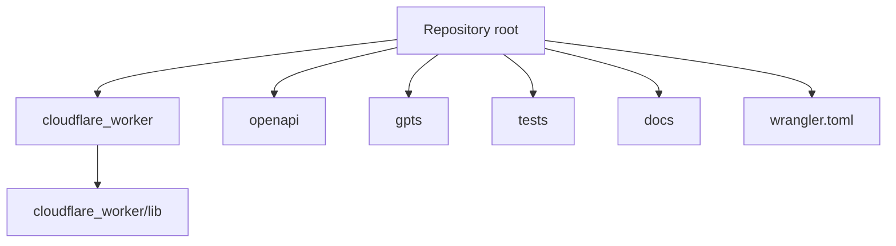

# Layout

## Repository Map

## Main Files

| Path | Purpose |
|---|---|
| `cloudflare_worker/worker.js` | Cloudflare Worker entrypoint and route dispatcher. |
| `cloudflare_worker/lib/ontology-data.js` | SCT ontology seed data. |
| `cloudflare_worker/lib/ontology.js` | Resolver helpers for DocumentType and RateBasis. |
| `cloudflare_worker/lib/type-b-classifier.js` | TYPE-B classification and override priority. |
| `cloudflare_worker/lib/evidence.js` | Evidence requirement and validation rules. |
| `cloudflare_worker/lib/gate.js` | Gate evaluator. |
| `openapi/hvdc_sct_ontology_actions.noauth.yaml` | GPT Builder schema for no-auth smoke testing. |
| `openapi/hvdc_sct_ontology_actions.apikey.yaml` | GPT Builder schema for API-key mode. |
| `gpts/GPT_INSTRUCTIONS_SCT_ONTOLOGY_ROUTER.md` | GPTS instruction patch. |
| `tests/curl_smoke_tests.sh` | Live smoke test script. |
| `tests/*.payload.json` | Action test payloads. |
| `docs/SCT_ONTOLOGY_IMPROVEMENT_EXECUTION_PLAN.md` | Seven-phase execution plan. |
| `docs/SCT_ONTOLOGY_IMPROVEMENT_SPEC.md` | Contract-style implementation spec. |
| `docs/superpowers/reports/2026-06-08-sct-ontology-deployment.md` | Deployment and regression report. |

## Generated Or Local-Only Outputs

These paths may exist locally but are not required for the Worker runtime:

- `.codex/root-docs-scan.json`
- `.codex/root-docs-write.json`
- `graphify-out/`
- `SCT_Ontology_Improvement_Plan_DocumentType_RateBasis_CustomsInspection_Override.docx`

Review these before committing because some are evidence artifacts rather than runtime source.

