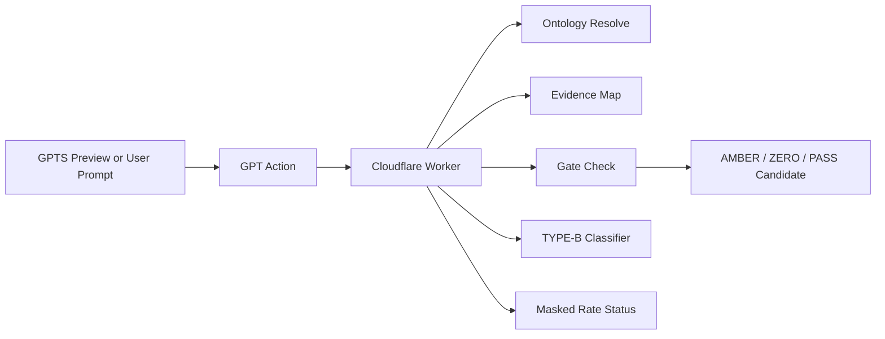

# HVDC SCT Ontology GPT Actions

Cloudflare Worker package for read-only GPT Actions used by the DSV Invoice Audit and SCT Ontology workflow.

The Worker exposes REST endpoints for ontology resolution, evidence mapping, gate checking, TYPE-B classification, masked rate status lookup, and masked audit trace creation. It does not approve invoices, execute payments, mutate ERP/TMS/WMS records, or disclose raw contract rates.

## Current Runtime

- Worker URL: `https://hvdc-ontology-chatgpt-app.mscho715.workers.dev`
- Worker entrypoint: `cloudflare_worker/worker.js`
- Wrangler config: `wrangler.toml`
- Latest local HEAD observed during documentation update: `d51e062`
- Runtime health observed after SWARM batch: `HVDC-SCT-ONTOLOGY-GPT-ACTIONS-REST-v2.4.0`
- OpenAPI schema generation target: v2.5.0

## Action Surface

| Operation | Path | Purpose |
|---|---|---|
| `resolveSctOntologyTerm` | `/ontology/resolve` | Resolve charge, document, shipment, and rate-basis terms to SCT codes. |
| `explainSctOntologyNode` | `/ontology/explain` | Explain a mapped SCT node without exposing private data. |
| `mapRequiredEvidence` | `/ontology/evidence-map` | Return required evidence and optional evidence validation status. |
| `checkSctOntologyGate` | `/ontology/gate-check` | Return PASS, AMBER, FAIL, or ZERO gate decisions. |
| `crosswalkSctToTypeB` | `/ontology/crosswalk` | Map SCT codes to TYPE-B and related hints. |
| `createOntologyAuditTrace` | `/ontology/audit-trace` | Return masked audit trace output. |
| `dryRunValidateInvoicePack` | `/dry-run/validate` | Validate invoice pack readiness without approval execution. |
| `dryRunClassifyTypeB` | `/dry-run/type-b-classify` | Classify invoice lines into TYPE-B. |
| `dryRunRateLookup` | `/dry-run/rate-lookup` | Return masked private-rate status only. |

All routes also support `/mcp/...` aliases for compatibility.

## Key Files

- `cloudflare_worker/worker.js`: Worker router and Action handlers.
- `cloudflare_worker/lib/ontology.js`: DocumentType and RateBasis resolution helpers.
- `cloudflare_worker/lib/type-b-classifier.js`: TYPE-B classifier and Customs Inspection override.
- `cloudflare_worker/lib/evidence.js`: Evidence requirement and validation rules.
- `cloudflare_worker/lib/gate.js`: Gate evaluator for subtotal, rate basis, evidence gaps, and tie-out controls.
- `openapi/hvdc_sct_ontology_actions.noauth.yaml`: No-auth GPT Builder schema.
- `openapi/hvdc_sct_ontology_actions.apikey.yaml`: API-key GPT Builder schema.
- `gpts/GPT_INSTRUCTIONS_SCT_ONTOLOGY_ROUTER.md`: GPTS operating instructions.
- `tests/curl_smoke_tests.sh`: Live smoke test script.

## Flow



## Verification

Use local checks before deploy:

```powershell
node --check cloudflare_worker/worker.js
node tests/_check_imports.mjs
node tests/_evidence_local_test.mjs
node tests/_gate_local_test.mjs
```

Use Wrangler for deployment:

```powershell
npx wrangler deploy
```

Use GPT Builder preview after deployment to verify:

- `ACTION_CALLED: YES`
- `SCT_ONTOLOGY_USED: YES`
- No raw contract rate or unmasked shipment identifiers in public output.

