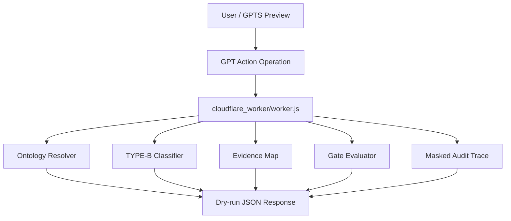

# System Architecture

## Overview

This package is a Cloudflare Workers REST wrapper for SCT Ontology GPT Actions. GPTS calls OpenAPI-defined operations, and the Worker returns dry-run, read-only semantic control outputs for invoice audit workflows.

## Components

| Component | File | Responsibility |
|---|---|---|
| Worker router | `cloudflare_worker/worker.js` | Normalizes routes, handles auth mode, dispatches Action handlers, and returns metadata. |
| Ontology resolver | `cloudflare_worker/lib/ontology.js` | Resolves DocumentType and RateBasis terms. |
| Ontology data | `cloudflare_worker/lib/ontology-data.js` | Holds SCT seed mappings and synonyms. |
| TYPE-B classifier | `cloudflare_worker/lib/type-b-classifier.js` | Classifies invoice line descriptions, including Customs Inspection override priority. |
| Evidence map | `cloudflare_worker/lib/evidence.js` | Maps SCT codes to required evidence and validates provided evidence. |
| Gate evaluator | `cloudflare_worker/lib/gate.js` | Blocks PASS when final subtotal, rate basis, evidence gaps, or tie-out checks fail. |
| OpenAPI schemas | `openapi/*.yaml` | Defines GPT Builder Action contract. |
| GPTS instructions | `gpts/GPT_INSTRUCTIONS_SCT_ONTOLOGY_ROUTER.md` | Defines Action mandatory routing and output rules. |
| Tests | `tests/*` | Provides payloads and local/live smoke assertions. |

## Runtime Flow



## Safety Boundaries

- All operations are dry-run and read-only.
- Invoice approval, payment, and ERP/TMS/WMS mutation are out of scope.
- Raw contract rates are never returned.
- Public responses must mask shipment, BL, BOE, TRN, container, personal, and approval references when applicable.
- GPTS must not claim final PASS if Action calls fail or ontology results are unavailable.

## Deployment Boundary

`wrangler.toml` points to:

```toml
name = "hvdc-ontology-chatgpt-app"
main = "cloudflare_worker/worker.js"
```

The production endpoint is:

```text
https://hvdc-ontology-chatgpt-app.mscho715.workers.dev
```

